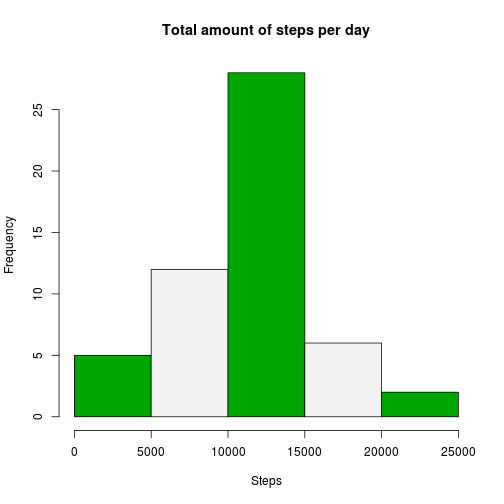
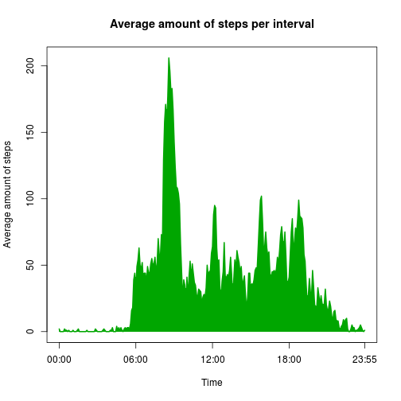
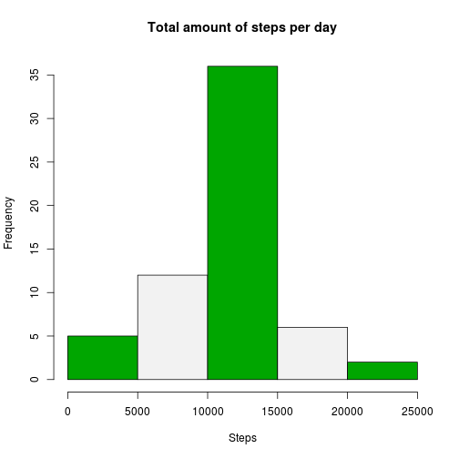
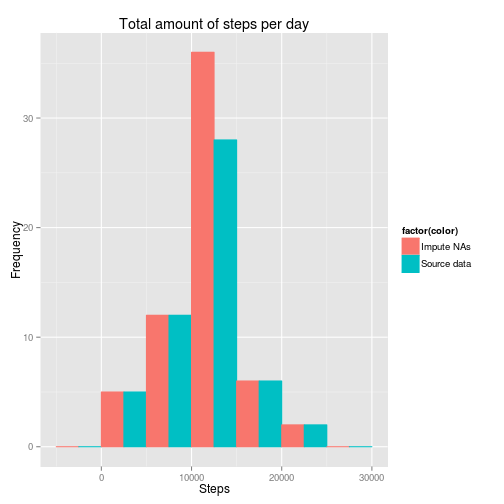
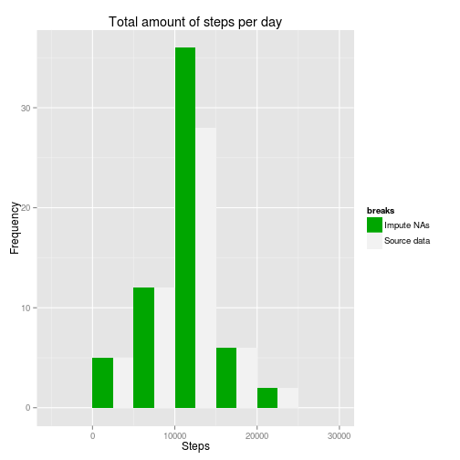
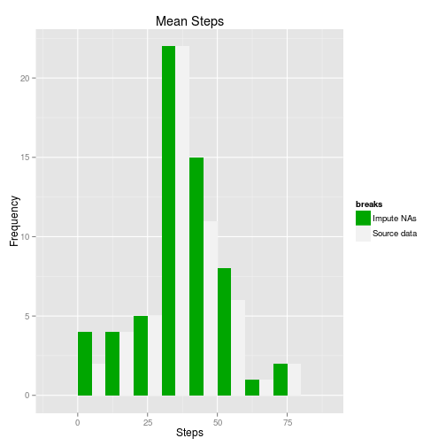

Programming Assignement 1
========================================================

## Introduction
It is now possible to collect a large amount of data about personal movement using activity monitoring devices such as a Fitbit, Nike Fuelband, or Jawbone Up. These type of devices are part of the “quantified self” movement – a group of enthusiasts who take measurements about themselves regularly to improve their health, to find patterns in their behavior, or because they are tech geeks. But these data remain under-utilized both because the raw data are hard to obtain and there is a lack of statistical methods and software for processing and interpreting the data.
  
This assignment makes use of data from a personal activity monitoring device. This device collects data at 5 minute intervals through out the day. The data consists of two months of data from an anonymous individual collected during the months of October and November, 2012 and include the number of steps taken in 5 minute intervals each day.
  
## Data
The data for this assignment can be downloaded from the course web site:
https://d396qusza40orc.cloudfront.net/repdata/data/activity.zip

    Dataset: Activity monitoring data [52K]

The variables included in this dataset are:

    steps: Number of steps taking in a 5-minute interval (missing values are coded as NA)

    date: The date on which the measurement was taken in YYYY-MM-DD format

    interval: Identifier for the 5-minute interval in which measurement was taken

The dataset is stored in a comma-separated-value (CSV) file and there are a total of 17,568 observations in this dataset.

## 1. Loading and preprocessing the data
First load dependent libraries.

```r
library("chron")
library("stringr")
library("ggplot2")
```

### Load the data (i.e. read.csv())
Read the content of the file with the read.csv() method as indicated in the description and show some basic information about the data via head(), str() and summary() functions.

```r
df.activity <- read.csv("activity.csv", stringsAsFactors=F, na.strings = "NA")
head(df.activity)
```

```
##   steps       date interval
## 1    NA 2012-10-01        0
## 2    NA 2012-10-01        5
## 3    NA 2012-10-01       10
## 4    NA 2012-10-01       15
## 5    NA 2012-10-01       20
## 6    NA 2012-10-01       25
```

```r
str(df.activity)
```

```
## 'data.frame':	17568 obs. of  3 variables:
##  $ steps   : int  NA NA NA NA NA NA NA NA NA NA ...
##  $ date    : chr  "2012-10-01" "2012-10-01" "2012-10-01" "2012-10-01" ...
##  $ interval: int  0 5 10 15 20 25 30 35 40 45 ...
```

```r
summary(df.activity)
```

```
##      steps           date              interval   
##  Min.   :  0.0   Length:17568       Min.   :   0  
##  1st Qu.:  0.0   Class :character   1st Qu.: 589  
##  Median :  0.0   Mode  :character   Median :1178  
##  Mean   : 37.4                      Mean   :1178  
##  3rd Qu.: 12.0                      3rd Qu.:1766  
##  Max.   :806.0                      Max.   :2355  
##  NA's   :2304
```

Remove observations containing NA values via na.omit() function.

```r
df.activity <- na.omit(df.activity)
```
### Process/transform the data (if necessary) into a format suitable for your analysis
We transform the date variable to the Date data-type.

```r
df.activity$date <- as.Date(df.activity$date, format="%Y-%m-%d")
```

## 2. What is mean total number of steps taken per day?
### For this part of the assignment, you can ignore the missing values in the dataset.  
### Make a histogram of the total number of steps taken each day
Aggregate the data

```r
df.aggregatedSum <- aggregate(steps~date, data=df.activity, FUN=sum)
```
Show histogram for total number of steps per day.

```r
hist(df.aggregatedSum$steps, 
     main="Total amount of steps per day", 
     xlab="Steps", 
     breaks=5,
     col=terrain.colors(2)
)
```

 

### Calculate and report the mean and median total number of steps taken per day
I have used the aggregate() method to calculate the mean and median values.


```r
df.aggregatedMean <- aggregate(df.activity$steps~df.activity$date,data=df.activity,FUN="mean")
names(df.aggregatedMean) <- c("date","steps")
df.aggregatedMean$steps <- round(df.aggregatedMean$steps,digits=0)

df.aggregatedMedian <- aggregate(df.activity$steps~df.activity$date,data=df.activity,FUN="median")
names(df.aggregatedMedian) <- c("date","steps")

df.aggregated <- merge(df.aggregatedMean, df.aggregatedMedian, by="date")
names(df.aggregated) <- c("date","mean", "median")
```
To report the data we print out the aggregated data.

```r
df.aggregated
```

```
##          date mean median
## 1  2012-10-02    0      0
## 2  2012-10-03   39      0
## 3  2012-10-04   42      0
## 4  2012-10-05   46      0
## 5  2012-10-06   54      0
## 6  2012-10-07   38      0
## 7  2012-10-09   44      0
## 8  2012-10-10   34      0
## 9  2012-10-11   36      0
## 10 2012-10-12   60      0
## 11 2012-10-13   43      0
## 12 2012-10-14   52      0
## 13 2012-10-15   35      0
## 14 2012-10-16   52      0
## 15 2012-10-17   47      0
## 16 2012-10-18   35      0
## 17 2012-10-19   41      0
## 18 2012-10-20   36      0
## 19 2012-10-21   31      0
## 20 2012-10-22   47      0
## 21 2012-10-23   31      0
## 22 2012-10-24   29      0
## 23 2012-10-25    9      0
## 24 2012-10-26   24      0
## 25 2012-10-27   35      0
## 26 2012-10-28   40      0
## 27 2012-10-29   17      0
## 28 2012-10-30   34      0
## 29 2012-10-31   54      0
## 30 2012-11-02   37      0
## 31 2012-11-03   37      0
## 32 2012-11-05   36      0
## 33 2012-11-06   29      0
## 34 2012-11-07   45      0
## 35 2012-11-08   11      0
## 36 2012-11-11   44      0
## 37 2012-11-12   37      0
## 38 2012-11-13   25      0
## 39 2012-11-15    0      0
## 40 2012-11-16   19      0
## 41 2012-11-17   50      0
## 42 2012-11-18   52      0
## 43 2012-11-19   31      0
## 44 2012-11-20   16      0
## 45 2012-11-21   44      0
## 46 2012-11-22   71      0
## 47 2012-11-23   74      0
## 48 2012-11-24   50      0
## 49 2012-11-25   41      0
## 50 2012-11-26   39      0
## 51 2012-11-27   47      0
## 52 2012-11-28   35      0
## 53 2012-11-29   24      0
```

## 3. What is the average daily activity pattern?
### Make a time series plot (i.e. type = "l") of the 5-minute interval (x-axis) and the average number of steps taken, averaged across all days (y-axis)
We use the chron package to convert to time. First we calculate the input string and then do the conversion.

```r
# aggregate the steps by interval
df.aggregatedMeanInterval <- aggregate(df.activity$steps~df.activity$interval,data=df.activity,FUN="mean")
names(df.aggregatedMeanInterval) <- c("interval","steps")

# to enhance readability we convert the interval to time
# convert interval to valid time format
df.aggregatedMeanInterval$interval <- str_pad(as.character(df.aggregatedMeanInterval$interval),4,"left","0")
df.aggregatedMeanInterval$interval <- paste(
    substr(df.aggregatedMeanInterval$interval,1,2),
    substr(df.aggregatedMeanInterval$interval,3,4),
    "00",
    sep=":")
# convert interval to time
df.aggregatedMeanInterval$interval <- chron(times=df.aggregatedMeanInterval$interval)  

# round the steps variable
df.aggregatedMeanInterval$steps <- round(df.aggregatedMeanInterval$steps,digits=0)

# generate the plot using type = “l” as mentioned in task description
plot(df.aggregatedMeanInterval$steps~df.aggregatedMeanInterval$interval, 
     xlab="Time",
     ylab="Average amount of steps", 
     main="Average amount of steps per interval", 
     type = "l",
     lwd = 2,
     xaxt="n")
# calculate x axis labels position and its label
x.time <- chron(times=c("00:00:00","06:00:00","12:00:00","18:00:00","23:55:00"))
x.label <- c("00:00","06:00","12:00","18:00","23:55")
# print x axis labels
axis(1, at=x.time,label=x.label)
```

 

### Which 5-minute interval, on average across all the days in the dataset, contains the maximum number of steps?

```r
# aggregate the mean steps per interval
df.aggregatedMeanInterval <- aggregate(df.activity$steps~df.activity$interval,data=df.activity,FUN="mean")
names(df.aggregatedMeanInterval) <- c("interval","steps")
# calculate the maximum number of steps
max.Obs <- which.max(df.aggregatedMeanInterval$steps)
max.Interval <- df.aggregatedMeanInterval[max.Obs,c(1)]
```
#### Conclusion
Show 5 minute interval with the maximum number of steps.

```r
# report max interval
max.Interval
```

```
## [1] 835
```

## 4. Imputing missing values
Note that there are a number of days/intervals where there are missing values (coded as NA). The presence of missing days may introduce bias into some calculations or summaries of the data.
### Calculate and report the total number of missing values in the dataset (i.e. the total number of rows with NAs)
Calculate total number of rows with NAs.

```r
# read data file again to include NA values
df.activity <- read.csv("activity.csv", stringsAsFactors=F, na.strings = "NA")
df.activity$date <- as.Date(df.activity$date, format="%Y-%m-%d")
# calculate amount of observations containing NA values
length(which(!complete.cases(df.activity)))
```

```
## [1] 2304
```
Show details about the data set to identify variables containing NA values:

```r
summary(df.activity)
```

```
##      steps            date               interval   
##  Min.   :  0.0   Min.   :2012-10-01   Min.   :   0  
##  1st Qu.:  0.0   1st Qu.:2012-10-16   1st Qu.: 589  
##  Median :  0.0   Median :2012-10-31   Median :1178  
##  Mean   : 37.4   Mean   :2012-10-31   Mean   :1178  
##  3rd Qu.: 12.0   3rd Qu.:2012-11-15   3rd Qu.:1766  
##  Max.   :806.0   Max.   :2012-11-30   Max.   :2355  
##  NA's   :2304
```
Only the steps variable contain NA values.

### Devise a strategy for filling in all of the missing values in the dataset. The strategy does not need to be sophisticated. For example, you could use the mean/median for that day, or the mean for that 5-minute interval, etc.
Retrieve more information about the NA values.
  
Calculate standard amount of observations per day.

```r
activity.Day <- aggregate(df.activity$interval~df.activity$date,data=df.activity,FUN="length")
names(activity.Day) <- c("date","entries")
summary(activity.Day$entries)
```

```
##    Min. 1st Qu.  Median    Mean 3rd Qu.    Max. 
##     288     288     288     288     288     288
```
We have 288 standard observations per day.

Retrieve all missing values by using is.na() funtion:

```r
missing.Values <- df.activity[is.na(df.activity$steps),]
```

Calculate days containing missing values and count entries per day.

```r
missing.Dates <- unique(df.activity[is.na(df.activity$steps),2])
missing.Entries <- aggregate(missing.Values$interval~missing.Values$date,data=missing.Values,FUN="length")
names(missing.Entries) <- c("date","entries")
summary(missing.Entries$entries)
```

```
##    Min. 1st Qu.  Median    Mean 3rd Qu.    Max. 
##     288     288     288     288     288     288
```
#### Conclusion
We can see that we are missing all values for 6 days. Resolving the NAs by the mean/median for that day does not work as all values for that date are missing. So we need to assign the missing values by the mean for that interval.

### Create a new dataset that is equal to the original dataset but with the missing data filled in.
Assign missing values per mean for that interval.

```r
df.aggregatedMeanInterval <- aggregate(df.activity$steps~df.activity$interval,data=df.activity,FUN="mean")
names(df.aggregatedMeanInterval) <- c("interval","steps")
df.aggregatedMeanInterval$steps <- round(df.aggregatedMeanInterval$steps, digits=0)

df.activityFix <- merge(df.activity, df.aggregatedMeanInterval, by="interval")
df.activityFix$steps.x[is.na(df.activityFix$steps.x)] <- df.activityFix[is.na(df.activityFix$steps.x),4]
df.activityFix$steps.y <- NULL
# restructure and sort the data frame to be similar with original data set
names(df.activityFix) <- c("interval","steps","date")
df.activityFix <- df.activityFix[,c(2,3,1)]
df.activityFix <- df.activityFix[order(df.activityFix$date,df.activityFix$interval), ]
#show content
head(df.activityFix)
```

```
##     steps       date interval
## 1       2 2012-10-01        0
## 63      0 2012-10-01        5
## 128     0 2012-10-01       10
## 205     0 2012-10-01       15
## 264     0 2012-10-01       20
## 327     2 2012-10-01       25
```

### Make a histogram of the total number of steps taken each day and 
Calculate total number of steps and show a histogram:

```r
df.activityFixSum <- aggregate(steps~date,data=df.activityFix,FUN=sum)
hist(df.activityFixSum$steps, 
     main="Total amount of steps per day", 
     xlab="Steps",
     breaks=5,
     col=terrain.colors(2))
```

 

### Calculate and report the mean and median total number of steps taken per day. Do these values differ from the estimates from the first part of the assignment? What is the impact of imputing missing data on the estimates of the total daily number of steps?


```r
df.aggregatedMeanFix <- aggregate(df.activityFix$steps~df.activityFix$date,data=df.activityFix,FUN="mean")
names(df.aggregatedMeanFix) <- c("date","steps")
df.aggregatedMeanFix$steps <- round(df.aggregatedMeanFix$steps,digits=0)

df.aggregatedMedianFix <- aggregate(df.activityFix$steps~df.activityFix$date,data=df.activityFix,FUN="median")
names(df.aggregatedMedianFix) <- c("date","steps")

df.aggregatedFix <- merge(df.activityFixSum, df.aggregatedMeanFix, by="date")
names(df.aggregatedFix) <- c("date","sum", "mean")
df.aggregatedFix <- merge(df.aggregatedFix, df.aggregatedMedianFix, by="date")
names(df.aggregatedFix) <- c("date","sum", "mean", "median")
```

Calculate differences to first part of assignement.

```r
# Calculate the dates that are missing in the first part of the assignement.
df.diff <- df.aggregatedFix[!df.aggregatedFix$date %in% df.aggregated$date,]
```
Show the dates are excluded from first part of assignement

```r
df.diff
```

```
##          date   sum mean median
## 1  2012-10-01 10762   37   34.5
## 8  2012-10-08 10762   37   34.5
## 32 2012-11-01 10762   37   34.5
## 35 2012-11-04 10762   37   34.5
## 40 2012-11-09 10762   37   34.5
## 41 2012-11-10 10762   37   34.5
## 45 2012-11-14 10762   37   34.5
## 61 2012-11-30 10762   37   34.5
```
Show amount of dates missing in first part of the assignement.

```r
nrow(df.diff)
```

```
## [1] 8
```
We have added 8 days by imputting the missing data.  

Show the impact of impute missing data.

#### Amount of Steps per day

```r
names(df.aggregatedSum) <- c("date","steps")

df.aggregatedSumFix <- aggregate(df.activityFix$steps~df.activityFix$date,data=df.activityFix,FUN="sum")
names(df.aggregatedSumFix) <- c("date","steps")

df.aggregatedSum$src <- "Source data"
df.aggregatedSumFix$src <- "Impute NAs"
df.hist <- rbind(df.aggregatedSum,df.aggregatedSumFix)
names(df.hist) <- c("date","steps","source")

color<-c(df.aggregatedSum$src,df.aggregatedSumFix$src) 
qplot(steps, 
      data = df.hist, 
      geom="histogram", 
      colour=factor(color), 
      fill=factor(color), 
      position = position_dodge(), 
      main="Total amount of steps per day", 
      xlab="Steps", 
      ylab="Frequency",
      binwidth=5000 
)
```

 

#### Average steps per interval

```r
df.aggregatedMean$src <- "Source data"
df.aggregatedMeanFix$src <- "Impute NAs"
df.hist <- rbind(df.aggregatedMean,df.aggregatedMeanFix)
names(df.hist) <- c("date","steps","source")

color<-c(df.aggregatedMeanFix$src,df.aggregatedMean$src) 
qplot(steps, 
      data = df.hist, 
      geom="histogram", 
      colour=factor(color), 
      fill=factor(color), 
      position = position_dodge(), 
      main="Mean Steps", 
      xlab="Steps", 
      ylab="Frequency",
      binwidth=10 
)
```

 

#### Median steps per interval

```r
df.aggregatedMedian$src <- "Source data"
df.aggregatedMedianFix$src <- "Impute NAs"
df.hist <- rbind(df.aggregatedMedian,df.aggregatedMedianFix)
names(df.hist) <- c("date","steps","source")

color<-c(df.aggregatedMedianFix$src,df.aggregatedMedian$src) 
qplot(steps, 
      data = df.hist, 
      geom="histogram", 
      colour=factor(color), 
      fill=factor(color), 
      position = position_dodge(), 
      main="Median Steps", 
      xlab="Steps", 
      ylab="Frequency",
      binwidth=10 
)
```

 

## 5. Are there differences in activity patterns between weekdays and weekends?
For this part the weekdays() function may be of some help here. Use the dataset with the filled-in missing values for this part.

### Create a new factor variable in the dataset with two levels – “weekday” and “weekend” indicating whether a given date is a weekday or weekend day.
I decided to switch the locale to "C" to use english weekdays name. Note that the locale "C" is valid on Linux.

```r
# Change current locale to be able to use english day names.
# This is tested with Ubuntu and might require a change for your operating system
Sys.setlocale("LC_TIME", "C") 
```

```
## [1] "C"
```

```r
df.activityFix$weekday <- weekdays(as.Date(as.character(df.activityFix$date),"%Y-%m-%d")) %in% c('Saturday','Sunday')
df.activityFix$weekday <- factor(df.activityFix$weekday, levels=c("TRUE","FALSE"), labels=c("weekend", "weekday"))
```
Show information about the calculated factor:

```r
str(df.activityFix$weekday)
```

```
##  Factor w/ 2 levels "weekend","weekday": 2 2 2 2 2 2 2 2 2 2 ...
```

## Make a panel plot containing a time series plot (i.e. type = "l") of the 5-minute interval (x-axis) and the average number of steps taken, averaged across all weekday days or weekend days (y-axis). 
Calculate input data

```r
df.weekday <- subset(df.activityFix, df.activityFix$weekday=="weekday")
df.weekend <- subset(df.activityFix, df.activityFix$weekday=="weekend")
```

Aggregate weekday information:

```r
df.weekdayInterval <- aggregate(df.weekday$steps~df.weekday$interval, data=df.weekday,FUN="mean")
names(df.weekdayInterval) <- c("interval","steps")
# convert interval to time
df.weekdayInterval$interval <- str_pad(as.character(df.weekdayInterval$interval),4,"left","0")
df.weekdayInterval$interval <- paste(
    substr(df.weekdayInterval$interval,1,2),
    substr(df.weekdayInterval$interval,3,4),
    "00",
    sep=":")
# convert to time
df.weekdayInterval$interval <- chron(times=df.weekdayInterval$interval)
# round steps variable
df.weekdayInterval$steps <- round(df.weekdayInterval$steps,digits=0)
```

Aggregate weekend information:

```r
df.weekendInterval <- aggregate(df.weekend$steps~df.weekend$interval, data=df.weekend,FUN="mean")
names(df.weekendInterval) <- c("interval","steps")
# convert interval to time
df.weekendInterval$interval <- str_pad(as.character(df.weekendInterval$interval),4,"left","0")
df.weekendInterval$interval <- paste(
    substr(df.weekendInterval$interval,1,2),
    substr(df.weekendInterval$interval,3,4),
    "00",
    sep=":")
# convert to time
df.weekendInterval$interval <- chron(times=df.weekendInterval$interval)
# round steps variable
df.weekendInterval$steps <- round(df.weekendInterval$steps,digits=0)
```

Print plots:

```r
# calculate x axis labels position and its label
x.time <- chron(times=c("00:00:00","06:00:00","12:00:00","18:00:00","23:55:00"))
x.label <- c("00:00","06:00","12:00","18:00","23:55")

par(mfrow=c(2,1))

plot(df.weekdayInterval$steps~df.weekdayInterval$interval, 
    xlab="Interval", 
    ylab="Steps", 
    main="Average number of steps (weekdays)", 
    type = "l",
    lwd = 2,
    xaxt="n")
# print x axis labels
axis(1, at=x.time,label=x.label)

plot(df.weekendInterval$steps~df.weekendInterval$interval, 
     xlab="Interval",
     ylab="Steps", 
     main="Average number of steps (weekend)", 
     type = "l",
     lwd = 2,
     xaxt="n")
# print x axis labels
axis(1, at=x.time,label=x.label)
```

 


