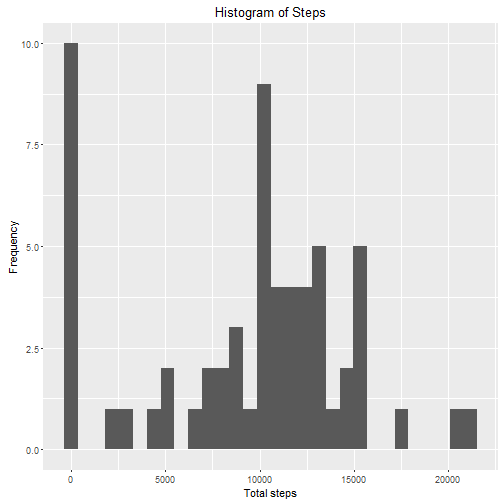
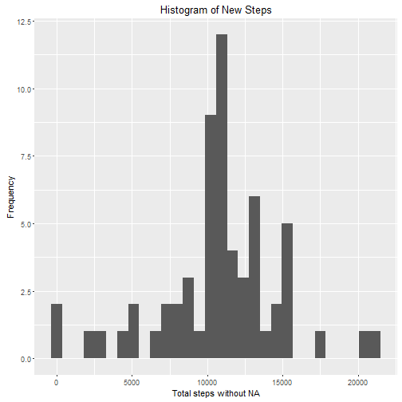

```r
---
title: "Reproducible Research: Peer Assessment 1"
author: "B.Y."
output: 
    html_document: PA1_template.html
    keep_md: true
---


## Loading and preprocessing the data

1 Unzip data files
```

```
## Error: <text>:12:3: unexpected symbol
## 11: 
## 12: 1 Unzip
##       ^
```

```r
fileName <- 'activity.zip'
unzip(fileName)
```

2 Load the data


```r
data.activity <- read.csv('activity.csv')
```


## What is mean total number of steps taken per day?

1 Calculate the total number of steps taken per day


```r
total.step <- aggregate(x = data.activity$steps, by = list(date=data.activity$date), FUN = "sum", na.rm = TRUE)
names(total.step) <- c("date","steps")
total.step$date <- as.factor(total.step$date)
```

2 Make a histogram of the total number of steps taken each day


```r
library(ggplot2)
qplot(total.step$steps, xlab='Total steps', ylab='Frequency',main="Histogram of Steps")
```

```
## `stat_bin()` using `bins = 30`. Pick better value with `binwidth`.
```



3 Calculate and report the mean and median of the total number of steps taken per day


```r
mean.steps <- mean(total.step$steps,na.rm = TRUE)
median.steps <- median(total.step$steps,na.rm = TRUE)
```

## What is the average daily activity pattern?

1 Make a time series plot of the 5-minute interval (x-axis) and the average number of steps taken, averaged across all days (y-axis)


```r
steps.interval <- aggregate(steps ~ interval, data = data.activity, FUN = mean)
plot(steps.interval, type = "l")
```


2 Which 5-minute interval, on average across all the days in the dataset, contains the maximum number of steps?


```r
steps.max <- which.max(steps.interval$steps)
steps.interval[steps.max,]
```

```
##     interval    steps
## 104      835 206.1698
```

## Imputing missing values

1 Calculate and report the total number of missing values in the dataset (i.e. the total number of rows with NAs)


```r
missing.total <- sum(is.na(data.activity))
```

2 Devise a strategy for filling in all of the missing values in the dataset. The strategy does not need to be sophisticated. For example, you could use the mean/median for that day, or the mean for that 5-minute interval, etc.


```r
steps_imputing<-merge(data.activity,steps.interval,by="interval")
#Rename columns in table
colnames(steps_imputing)<-c('interval','steps_RAW','date','steps_mean')

#Initialise the imputing column with original data
steps_imputing$steps_imputing<-steps_imputing$steps_RAW

#Replace missing steps with average steps
steps_imputing$steps_imputing[is.na(steps_imputing$steps_RAW)==TRUE]<-steps_imputing$steps_mean[is.na(steps_imputing$steps_RAW)==TRUE]
```

3 Create a new dataset that is equal to the original dataset but with the missing data filled in.


```r
data.activity.new <-steps_imputing
```

4 Make a histogram of the total number of steps taken each day and calculate and report the mean and median total number of steps taken per day. Do these values differ from the estimates from the first part of the assignment? What is the impact of imputing missing data on the estimates of the total daily number of steps?


```r
#calculate the total steps taken per day
total.step.new <- aggregate(x = data.activity.new$steps_imputing, by = list(date=data.activity.new$date), FUN = "sum", na.rm = TRUE)
#rename the col name
names(total.step.new) <- c("date","steps")
total.step.new$date <- as.factor(total.step.new$date)
#create the histogram 
library(ggplot2)
qplot(total.step.new$steps, xlab='Total steps without NA', ylab='Frequency',main="Histogram of New Steps")
```

```
## `stat_bin()` using `bins = 30`. Pick better value with `binwidth`.
```



```r
#calculate the new mean and new median steps for the new dataset
mean.steps.new <- mean(total.step.new$steps,na.rm = TRUE)
median.steps.new <- median(total.step.new$steps,na.rm = TRUE)
```

## Are there differences in activity patterns between weekdays and weekends?
1 Create a new factor variable in the dataset with two levels �C “weekday” and “weekend” indicating whether a given date is a weekday or weekend day.


```r
data.activity.new$date<-as.POSIXct(data.activity.new$date)
#Add weekday flags and view first several rows
data.activity.new$daytype<-weekdays(data.activity.new$date)


#Add weekday/weekend flags and view first several rows
data.activity.new$daytype_Flag<-"weekday"
data.activity.new$daytype_Flag[data.activity.new$daytype %in% c("星期六", "星期日")]<-"weekend"
head(data.activity.new)
```

```
##   interval steps_RAW       date steps_mean steps_imputing daytype
## 1        0        NA 2012-10-01   1.716981       1.716981  星期一
## 2        0         0 2012-11-23   1.716981       0.000000  星期五
## 3        0         0 2012-10-28   1.716981       0.000000  星期日
## 4        0         0 2012-11-06   1.716981       0.000000  星期二
## 5        0         0 2012-11-24   1.716981       0.000000  星期六
## 6        0         0 2012-11-15   1.716981       0.000000  星期四
##   daytype_Flag
## 1      weekday
## 2      weekday
## 3      weekend
## 4      weekday
## 5      weekend
## 6      weekday
```

2 Make a panel plot containing a time series plot (i.e. type = "l") of the 5-minute interval (x-axis) and the average number of steps taken, averaged across all weekday days or weekend days (y-axis). See the README file in the GitHub repository to see an example of what this plot should look like using simulated data.


```r
steps.interval.new <- aggregate(data.activity.new$steps_imputing, by=list(data.activity.new$daytype_Flag, data.activity.new$interval), mean, na.rm=TRUE, na.action=NULL)
names(steps.interval.new) <- c("daytype_Flag","interval","mean.steps")
library(lattice) 
xyplot(steps.interval.new$mean.steps ~ steps.interval.new$interval | steps.interval.new$daytype_Flag, layout=c(1,2), type="l",xlab = "Interval",ylab = "Number of steps")
```


```

